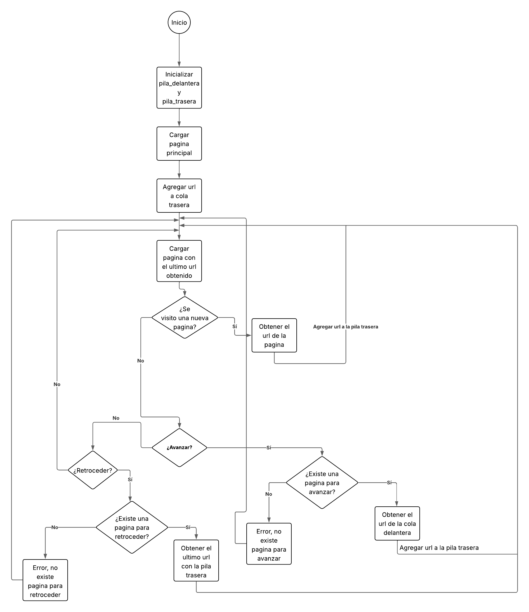
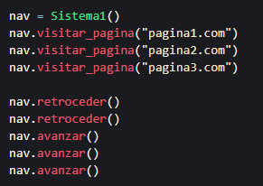
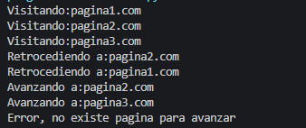

La simulacion propuesta maneja los sitios visitados, siendo estos ingresados por el usuario y al mismo tiempo obteniendo la url para luego almacenarlo en pilas, permite la obtencion de sitios visitados anteriormente mediante el uso de la pila trasera, y visitar sitios ya vistos mediante el uso de la pila delantera
# Diagrama de flujo

# Inputs para la simulacion #1

# Outputs de la simulacion #1

# Inputs para la simulacion #2

# Outputs de la simulacion #2

