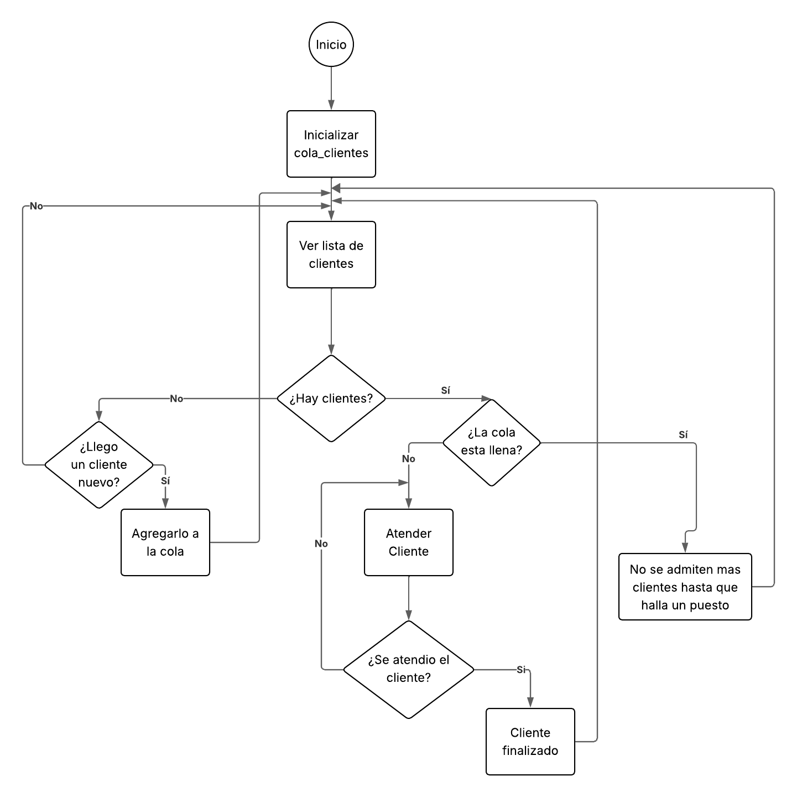
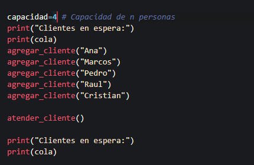
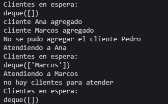
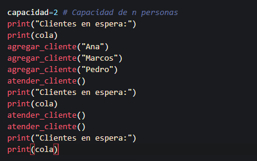

# Simulacion con colas
La simulacion presente permite dar a entender el uso de las colas cuando se tiene un contexto de una cantidad limitada de clientes para atender y un modelo de FIFO (First in, First Out) para un proceso que tarda una cantidad n de tiempo. Este modelo representa la obtencion de un ticket en un cine, la llegada de los clientes sera completamente al azar, 
# Diagrama de flujo

# Inputs #1

# Outputs #1

# Inputs #2

# Outputs #2

